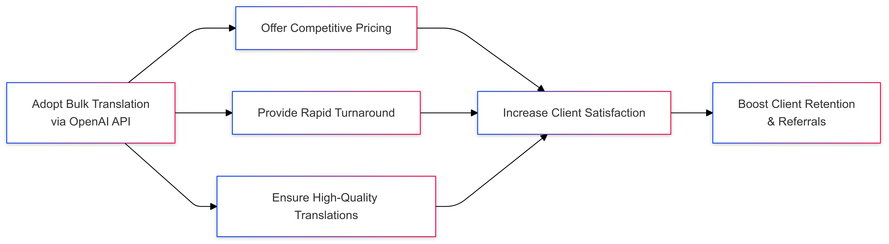

# Text Translator Automation

Translate your text files effortlessly from any language to English using the power of OpenAI's advanced language models. This tool is designed to make translations simple, efficient, and accessible to everyone.

## 🎯 Purpose

In today's interconnected world, clear communication across different languages is more important than ever. This script is designed to make translating text files into English effortless and efficient. By automating the translation process, it allows individuals and businesses to quickly convert large volumes of text from various languages without the hassle of manual translation. This means you can focus on understanding and utilizing the content rather than getting bogged down in the translation process.


> Benefits of using automated GPT translations in your workflow.

For translation companies, this tool offers a significant boost in productivity. By automating the initial translation of documents, it frees up professional translators to concentrate on refining and perfecting translations rather than starting from scratch. This not only speeds up project turnaround times but also reduces costs associated with manual translation efforts. The script ensures consistency and accuracy, providing a reliable first draft that human translators can then polish, ultimately enhancing the quality of service offered to clients.


> Advantages gained by enhancing your translation process with LLM-powered automation.


## 📖 Introduction

Welcome to the Text Translator Automation project! This script automates the translation of text files from various languages into English. By leveraging OpenAI's state-of-the-art language models, you can achieve high-quality translations without manual effort.

Whether you're dealing with international documents, multilingual datasets, or just need quick translations, this tool simplifies the process by reading your files, translating the content, and saving the results—all with a single command.

## 🚀 Features

- **High-Quality Translations**: Utilize OpenAI's advanced models for accurate and context-aware translations.
- **Automated Workflow**: No need for manual copying and pasting; the script handles everything.
- **Organized Output**: Translated files are neatly saved in the `/translated` directory.
- **Environment Isolation**: Supports Conda environments for easy dependency management.

## 🛠 Installation

Follow these steps to set up and run the project:

### 1. **Clone the Repository** (if you haven't already):

```bash
git clone https://github.com/monarchwadia/simple-llm-translation-example.git
cd simple-llm-translation-example
```

### 2. **Set Up a Virtual Environment** (optional but recommended):

```bash
# Create a new environment named 'translate'
conda create -n simple-llm-translation-example
# Activate the environment
conda activate simple-llm-translation-example
# Install Python 3.12
conda install python=3.12
   ```

### 3. **Install Dependencies**:

```bash
pip install -r requirements.txt
```

### 4. **Configure OpenAI API Key**:

Add your OpenAI API key to a new `.env` file:

```bash
echo 'OPENAI_API_KEY=your-openai-api-key' > .env
```

Replace `your-openai-api-key` with your actual OpenAI API key.

## 📄 Usage

### 1. **Prepare Your Text Files**:

Place all the text files you want to translate into the `/files` directory:

```bash
echo 'namaste, aap kaise hai?' > ./files/namaste.txt
```

### 2. **Run the Translation Script**:

```bash
python translate.py
```

### 3. **Retrieve Your Translated Files**:

After running the script, you'll find the translated files in the `/translated` directory.

```md
# /translated/namaste.txt
hello, how are you?
```

## ✅ Strengths

- **User-Friendly**: Easy to set up and use, even for those with minimal programming experience.
- **Efficient**: Automates the translation of multiple files, saving time and effort.
- **Accurate Translations**: OpenAI's advanced language processing capabilities, while not perfect, are still accurate and take many human nuances into account.
- **Organized File Management**: Keeps original and translated files neatly separated for clarity.
- **Scalable**: Suitable for both small projects and large-scale translation needs.

## ⚠️ Limitations

- **Context length**: We are using `gpt-4o-mini` which has a context window (i.e. input limit) of `128K` tokens and an output limit of `16,384` tokens. This means it can translate texts of approximately `12,000` words.
- **OpenAI API Key Required**: An active OpenAI API key is necessary, which may involve usage costs.
- **Internet Connection Needed**: Requires internet access to communicate with the OpenAI API.
- **Language Support Variance**: While many languages are supported, some may not be fully compatible or may result in less accurate translations.
- **Plain Text Files Only**: Currently supports only `.txt` files; other formats like PDF or DOCX are not supported without additional customization.
- **Machine Translation Nuances**: Automated translations might not capture all cultural nuances or specialized terminology. Manual review is recommended for critical documents.
- **Serial Processing**: The current script translates in serial instead of in parallel, increasing time to execute.

## 🤝 Contributing

Contributions are welcome! If you'd like to enhance this project, feel free to fork the repository and submit a pull request.

1. **Fork the Repository**

2. **Create a Feature Branch**

   ```bash
   git checkout -b feature/YourFeature
   ```

3. **Commit Your Changes**

   ```bash
   git commit -m 'Add Your Feature'
   ```

4. **Push to the Branch**

   ```bash
   git push origin feature/YourFeature
   ```

5. **Open a Pull Request**

## 📜 License

This project is licensed under the MIT License. See the [LICENSE.md](LICENSE.md) file for details.

## 📞 Contact

For questions or suggestions, please open an issue or contact the project maintainer.

---

By providing this tool, we aim to simplify the process of translating text files, making it accessible to anyone who needs it. While it's a powerful tool, it's important to be aware of its limitations to ensure it meets your specific needs effectively.
